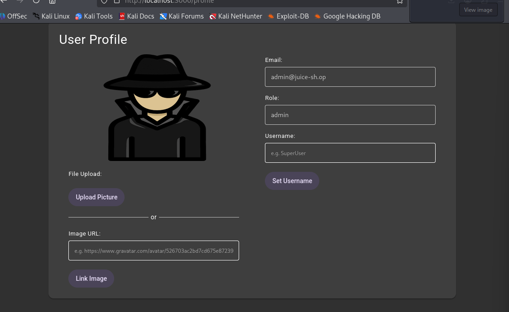

# SQL Injection Authentication Bypass (OWASP Juice Shop)

## Objective
Determine if the login form is vulnerable to SQL injection, allowing authentication bypass.

## Method
Payload entered into the login form's email field:

' OR 1=1--

Password field: any value.

Target: OWASP Juice Shop (bkimminich/juice-shop), running locally via Docker on localhost:3000, login page at `#/login`.

## Evidence
Login succeeded without valid credentials, authenticating as the first matching user in the database (typically the admin account).

## Findings
- The login form does not use parameterized queries; user input is concatenated directly into the backend SQL statement
- The payload `' OR 1=1--` alters the query logic so it matches every row in the users table, returning the first (commonly admin) account
- This results in a full authentication bypass with no valid credentials required

## Detection Angle
A web application firewall (WAF) with SQL injection signature rules would typically flag this payload (`' OR 1=1--` is one of the most well-known SQLi patterns). Server-side, this would also show up as an anomalous login query returning unrestricted results rather than a single matched user — a backend query logger or ORM-level anomaly detector could catch this even without a WAF. Unlike the XSS finding on this same application, this vulnerability requires a server round-trip and so **is** visible to network-layer monitoring, unlike the client-side XSS.

## Remediation
- Use parameterized queries / prepared statements for all database interactions — never concatenate user input into SQL strings
- Apply input validation and reject special characters where not expected (e.g. `'`, `--`) in login fields
- Enforce least-privilege database accounts so even a successful injection has limited blast radius
